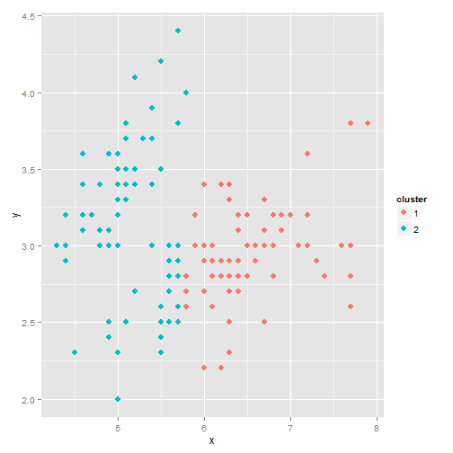
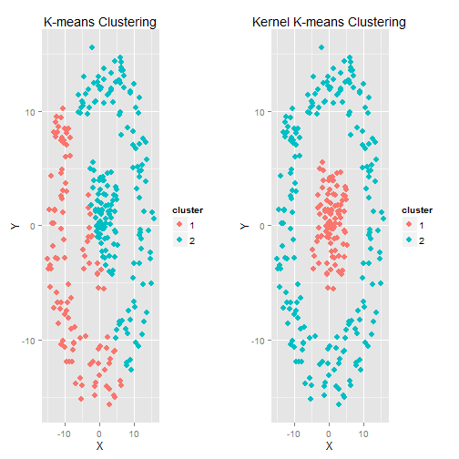

## What is K-means?

K-means is a cluster analysis model used to cluster linear points in a data set

But how effective is it at clustering when the data is non-linear?

---
## K-means Cluster and Kernel K-means Cluster

## How does Kernel K-means differ?

Kernel k-means is an extension of the standard k-means algorithm that maps data points from input space to a higher dimensional feature space through a nonlinear transformation and minimizes the clustering error in feature space. But it does have its limitations....

---

## The Shiny Application

My shiny application, which you can run at [my Shiny App page,](https://lxdnz-254.shinyapps.io/ClusterAnalysis/ "Cluster ShinyApp") works by selecting the type of cluster modelling, (k-means or Kernel K-means) and number of clusters. From the inputs it produces a cluster plot showing the clustered dataset. It also runs a cross-validation test and gives results for Purity and NMI (Normalized Mutual Information).

In its current form, this application would be a useful teaching aid to show the difference between the two methods, and to highlight some of the drawbacks of each cluster model.
e.g. What happens when $\sigma$ (sigma) is set to high using the Kernel K-means algorithm?

The cross-validation test only gives a true result when the number of clusters is set to 2. For clusters larger than 2, the app generates a random test set based on the number of clusters selected and then produces results for NMI & Purity based on this random truth set. These results do not always reflect the exactness of the algorithms running.

---

## Further Developments 

This shiny app could become a very powerful tool, enabling quick cluster analysis on the fly.

It could be useful for presentations requiring various datasets, or to show different model results.
As a tool for data analysis, it could be used to visualise (quickly) some cluster model theories over a dataset, perhaps saving the user time by helping to rule out or select a model to optimise for their dataset.

In the future, I would like to incorporate into the Shiny App

 * Ability to choose datasets and variables
 * Select truth data sets
 * Select different types of cluster modelling
 * Change the style of plot output

To view the source code for the app or to collaborate visit my [Github Repo.](https://github.com/lxdnz254/ShinyApp)

